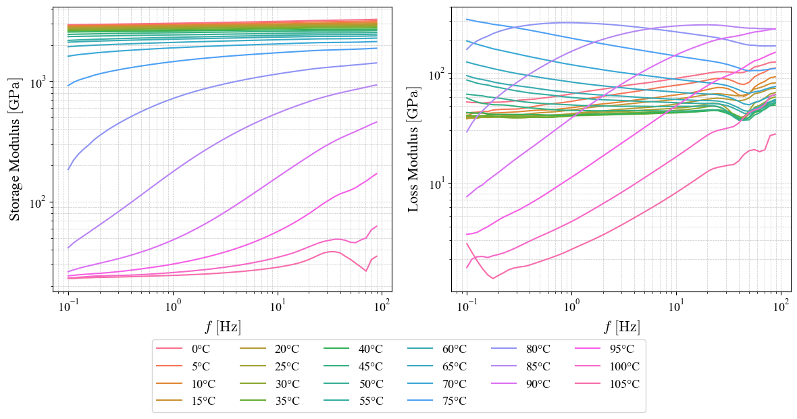

# DMA-analysis-suite
A Python library for processing and analyzing Dynamic Mechanical Analysis (DMA) data, including master curve construction, Prony series fitting, and temperature-dependent shift modeling. This tool provides a comprehensive workflow for aligning, fitting, and interpreting viscoelastic data.


# Auto Mastercurve

Auto Mastercurve is a Python package designed for analyzing and modeling Dynamic Mechanical Analysis (DMA) data. This tool provides functionalities for constructing master curves, fitting Prony series for viscoelastic behavior, and modeling temperature-dependent shifts.

---

## Features

1. **MasterCurve**
   - Reads raw DMA `.txt` files (e.g., `T0.txt`, `T-10.txt`).
   - Cleans and processes the data.
   - Constructs a master curve by shifting data to align with a reference temperature.
   - Allows re-shifting to different reference temperatures.

2. **MastercurveFitter**
   - Fits Prony series parameters (relaxation times and coefficients) to frequency-dependent DMA data.
   - Provides visualizations of experimental vs. fitted moduli (Storage and Loss).
   - Outputs optimized Prony parameters.

3. **TemperatureDependency**
   - Models temperature-dependent shift factors using polynomial fits.
   - Predicts shift factors at new temperatures.
   - Visualizes the relationship between temperature and shift values.

---

## Installation

To install, clone this repository and ensure the necessary dependencies are installed:

```bash
git clone https://github.com/your-username/auto-mastercurve.git
cd auto-mastercurve
pip install -r requirements.txt
```

Dependencies include:
- `numpy`
- `pandas`
- `matplotlib`
- `scipy`
- `sklearn`

---

## Directory Structure

```
auto_mastercurve/
├── auto_mastercurve/
│   ├── __init__.py
│   ├── core.py
│   ├── Data/            # Raw DMA data files (T*.txt)
├── tests/
│   ├── results/         # Output files (CSV, plots)
│   ├── Example.ipynb    # Usage demonstration in Jupyter Notebook
```

---

## Usage

### Master Curve Construction

```python
from auto_mastercurve.core import MasterCurve
from pathlib import Path

data_folder = Path("C:/Users/matay/Desktop/Python_package/auto_mastercurve/auto_mastercurve/Data")
ref_temperature = 73.0  # Reference temperature in °C

mc = MasterCurve(do_plot=True)
final_curve, metadata = mc.build_master_curve(data_folder)

# Optionally re-shift to a new reference temperature
final_after_shift, temp_shift = mc.adjust_shift(
    T_ref_new=ref_temperature,
    Temp_Shift=temp_shift,
    Final=final_curve
)
```

### Prony Series Fitting

```python
from auto_mastercurve.core import MastercurveFitter

# Load master curve data
results_path = "C:/Users/matay/Desktop/Python_package/auto_mastercurve/tests/results"
filename = "final_after_shift.csv"

df = pd.read_csv(f"{results_path}/{filename}")
df['f'] = (10 ** df['f']) * 2 * np.pi
df['Storage'] = 10 ** df['Storage']
df['Loss'] = 10 ** df['Loss']

fitter = MastercurveFitter(df=df, checkpoint=2.4e3, rolling_window=20)
fitter.preprocess_and_filter()
fitter.compute_tau()
fitter.fit_prony_series()
fitter.plot_fitted_results()

# Get Prony parameters
prony_params = fitter.get_prony_parameters()
print(prony_params)
```

### Temperature-Dependent Shifts

```python
from auto_mastercurve.core import TemperatureDependency

# Load temperature-shift data
temp_shift_file = "C:/Users/matay/Desktop/Python_package/auto_mastercurve/tests/results/temp_shift.csv"
df_shift = pd.read_csv(temp_shift_file)

T = df_shift['Tr'].values
shift_values = df_shift['Shift_value'].values

temp_dep = TemperatureDependency(T=T, shift=shift_values, T_ref=20)
coeffs, r2 = temp_dep.fit_polynomial(degree=3)
temp_dep.plot_fit()
```

---

## Example Outputs

### Quick Check (Storage and Loss)



### Master Curve Before and After Shifting


### ln(a_T) vs. 1/T Fit


### Fitted Prony Series


---

## Mathematical Background

The project uses frequency-domain representations of viscoelastic behavior:

**Storage Modulus**:

$$
E_s(\omega) = E_0 \left[1 - \sum_{i=1}^N e_i 
ight] + E_0 \sum_{i=1}^N rac{e_i 	au_i^2 \omega^2}{1 + 	au_i^2 \omega^2}
$$

**Loss Modulus**:

$$
E_{\ell}(\omega) = E_0 \sum_{i=1}^N rac{e_i 	au_i \omega}{1 + 	au_i^2 \omega^2}
$$

---

## License

This project is licensed under the MIT License. See the `LICENSE` file for details.

---
